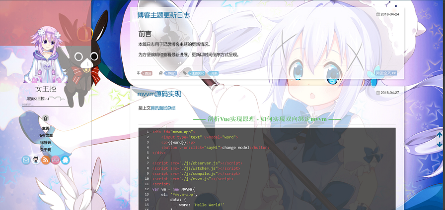
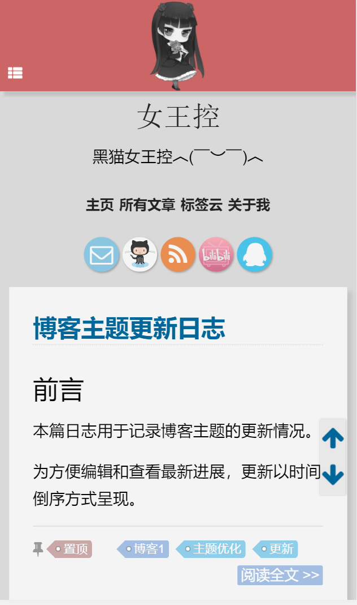

# TowavePhone的博客

[](http://hexo.io)
[](http://120.79.62.126:10080/towavephone/TowavePhoneBlog/commits/master)
[]()

本博客是基于 [MOxFIVE/hexo-theme-yelee](https://github.com/MOxFIVE/hexo-theme-yelee) 制作的主题，其中添加更改了大量功能。

崇尚美观的 UI，以及极致的移动端阅读体验，你可以点击 [我的博客](http://towavephone.coding.me/) 查看效果。    

如果本主题也是你喜欢的菜，请动动手指 Star 支持一下

## 效果预览

<div align="center"></div>

<div align="center"></div>

## 博客改进日志

[见这里](http://towavephone.coding.me/2018/04/24/update/)     

## 使用

### Yarn

``` bash
yarn
// 因为 node_modules 文件夹里面有改动
git checkout .
yarn dev
git add .
// 输入的提交信息必须为英文
yarn cm
yarn prod
yarn deploy
```

### npm

``` bash
npm install
git checkout .
npm run dev
git add .
npm run cm
npm run prod
npm run deploy
```

## 其他

### 感谢

在设计这个博客的时候参考了好多主题和博客的设计和创意，深表感谢！

### 贡献

接受各种形式的贡献，包括但不限于提交问题或需求，修复代码，欢迎大家提 Issue 或者 Pull Request。

如果觉得本博客还不错，欢迎 Star 下，您的支持和鼓励才是后续更新最大的动力！

当然，也欢迎 fork 后创建自己的博客！

